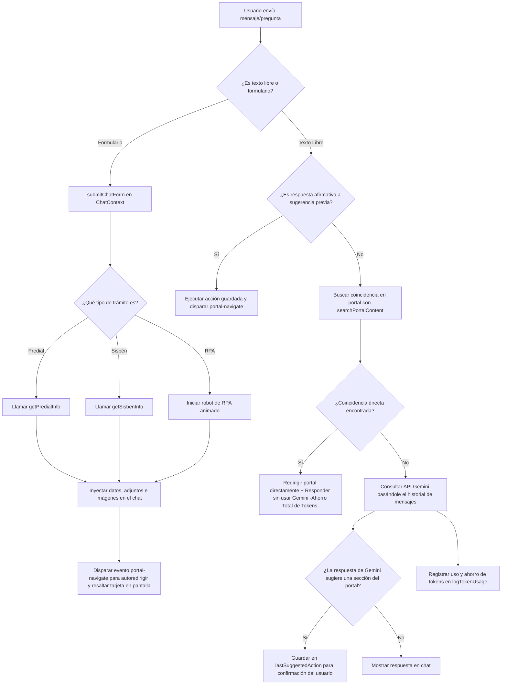

# Documentación Detallada del Sistema del Portal y Chatbot: Alcaldía de El Retiro

Este documento proporciona una explicación exhaustiva y técnica de cada parte del código de la aplicación. La plataforma está estructurada como una Aplicación de Página Única (SPA) construida sobre **React + Vite** y diseñada bajo la filosofía de **Diseño Atómico (Atomic Design)** para los componentes de interfaz, con un flujo centralizado de estado usando la **API de Contexto de React**, y servicios integrados de IA (**Google Gemini 1.5 Flash**) y automatización simulada (**RPA**).

---

## 🗺️ Mapa de la Estructura del Proyecto

A continuación se muestra el árbol de archivos clave analizados:

```text
src/
├── main.jsx                 # Punto de entrada de la aplicación en React.
├── App.jsx                  # Componente raíz que monta el diseño del portal.
├── index.css                # Estilos globales y variables de diseño premium.
├── App.css                  # Estilos adicionales para la aplicación.
├── embed.jsx                # Script para embeber e inyectar el chatbot en portales externos.
├── context/
│   └── ChatContext.jsx      # Cerebro del chatbot (estado global, API Gemini, flujos RPA/Trámites).
├── services/
│   ├── gemini.js            # Cliente e integrador de la API de Google Gemini con optimización de tokens.
│   ├── apiMock.js           # Base de datos simulada y llamadas a APIs de Sisbén, Predial y RPA.
│   └── portalData.js        # Base de datos de contenidos del portal y motor de búsqueda para redirecciones.
└── components/
    ├── atoms/               # Bloques de construcción básicos y sin dependencias del sistema.
    │   ├── Badge.jsx        # Etiqueta visual para indicar categorías, estados o secciones.
    │   ├── Button.jsx       # Botón premium interactivo reutilizable.
    │   ├── Input.jsx        # Campo de entrada de texto optimizado.
    │   └── StatusDot.jsx    # Indicador de estado de conexión animado.
    ├── molecules/           # Grupos de átomos combinados para cumplir una función simple.
    │   ├── ChatBubble.jsx   # Burbuja de mensaje individual que maneja textos, formularios e imágenes.
    │   └── QuickReplies.jsx # Contenedor de botones de respuestas rápidas en el chat.
    ├── organisms/           # Secciones complejas de la interfaz compuestas de moléculas y átomos.
    │   ├── ChatForm.jsx     # Formulario interactivo inyectable dentro del chat.
    │   ├── ChatWindow.jsx   # La ventana y cajón flotante completo del chatbot.
    │   ├── PortalSidebar.jsx# Barra lateral de navegación del portal ciudadano.
    │   └── PortalView.jsx   # Contenedor dinámico que renderiza las vistas (Trámites, Historia, etc.).
    └── templates/           # Estructuras de diseño que organizan los organismos.
        └── PortalLayout.jsx # Distribuye el PortalSidebar, el PortalView y maneja eventos de navegación.
```

---

## 🧬 1. Arquitectura y Patrones de Diseño

### 1.1 Atomic Design (Diseño Atómico)
La UI está dividida en cuatro niveles modulares:
1. **Atoms (Átomos)**: Componentes mínimos que no se pueden subdividir (ej. un botón, un badge o una luz de estado). Son puramente visuales y no contienen lógica de negocio.
2. **Molecules (Moléculas)**: Combinaciones de átomos. Por ejemplo, `ChatBubble` combina textos con archivos adjuntos y estados de tiempo; `QuickReplies` une múltiples botones en una lista de opciones rápidas.
3. **Organisms (Organismos)**: Estructuras más complejas que operan juntas. `ChatWindow` controla el ciclo de vida del chat; `PortalView` expone múltiples bloques interactivos e implementa la navegación.
4. **Templates (Plantillas)**: Abstracciones a nivel de página que configuran la estructura y el flujo de comunicación visual entre organismos (ej. `PortalLayout` gestiona cómo la barra lateral interactúa con la vista central mediante eventos globales).

### 1.2 State Management (Gestión de Estado Centralizada)
Toda la lógica de comunicación, consumo de la API de Gemini, llamadas simuladas de datos y estados de visibilidad de la interfaz se concentra en [ChatContext.jsx](file:///C:/Users/everd/Documents/antigravity/modest-pythagoras/src/context/ChatContext.jsx). Esto evita el acoplamiento directo entre los componentes y facilita el mantenimiento.

---

## 📄 2. Explicación Detallada de Cada Archivo

### 📌 Puntos de Entrada y Configuración

#### 1. [main.jsx](file:///C:/Users/everd/Documents/antigravity/modest-pythagoras/src/main.jsx)
Es el archivo que arranca la aplicación. Utiliza `react-dom/client` para montar el componente `<App />` dentro del elemento HTML con ID `root`. Está envuelto en `<StrictMode>` para activar advertencias durante el desarrollo.

#### 2. [App.jsx](file:///C:/Users/everd/Documents/antigravity/modest-pythagoras/src/App.jsx)
Actúa como la raíz del árbol de componentes de React. Importa y renderiza directamente `<PortalLayout />`, el cual encapsula el esqueleto visual completo del portal web.

#### 3. [embed.jsx](file:///C:/Users/everd/Documents/antigravity/modest-pythagoras/src/embed.jsx)
Este script permite desacoplar el chatbot del portal principal para inyectarlo de forma autónoma en otros sitios web municipales.
- Crea dinámicamente un elemento `div` en el cuerpo del documento (`chatbot-service-root`).
- Monta la interfaz del chatbot envuelta en su propio proveedor de estado:
  ```jsx
  root.render(
    <ChatProvider>
      <ChatWindow />
    </ChatProvider>
  );
  ```

---

### ⚙️ Capa de Servicios (`src/services/`)

#### 4. [gemini.js](file:///C:/Users/everd/Documents/antigravity/modest-pythagoras/src/services/gemini.js)
Este servicio administra la comunicación directa con la API oficial de Google Gemini (modelo **gemini-1.5-flash**).
- **System Instructions (`SYSTEM_PROMPT`)**: Configura el comportamiento institucional de la IA como asistente de la Alcaldía. Define **reglas críticas para el ahorro de tokens**, obligando a la IA a responder de forma extremadamente concisa (1 o 2 líneas, máximo 20 palabras) y a delegar la descripción de trámites complejos al sistema local de navegación.
- **`queryGemini(messageHistory, apiKey)`**:
  - Transforma el historial de mensajes de la aplicación al formato oficial requerido por Google (`user` y `model`).
  - Envía la solicitud `POST` a la API de generación de contenidos de Gemini.
  - Configura `generationConfig.maxOutputTokens: 60` para recortar respuestas largas que generen sobrecostos.
  - Estima y retorna las métricas de consumo de tokens:
    - `tokensUsed`: Estimación basada en la longitud de caracteres (división aproximada por 4).
    - `savedTokens`: Estimación de tokens ahorrados por mantener una longitud ultra corta de salida.
- **`queryMockGemini(userMessage)`**: Mecanismo de contingencia (fallback) cuando el usuario no ha ingresado una clave de API. Simula la latencia de red y analiza palabras clave del mensaje (`predial`, `sisben`, `historia`, `turismo`) para retornar respuestas institucionales emuladas.

#### 5. [apiMock.js](file:///C:/Users/everd/Documents/antigravity/modest-pythagoras/src/services/apiMock.js)
Simula los sistemas de backend del municipio de El Retiro.
- **Bases de Datos Locales (`predialDB`, `sisbenDB`)**: Almacenan registros de ejemplo vinculados a cédulas de ciudadanía específicas (como `"12345678"` y `"87654321"`). Incluyen datos reales del propietario, ubicación del predio, valores financieros, clasificación del Sisbén IV, URLs de descarga y enlaces a imágenes reales para el renderizado.
- **`getPredialInfo(documento)`** y **`getSisbenInfo(documento)`**: Simulan peticiones asíncronas con una latencia artificial de 800ms para emular consultas reales a bases de datos remotas.
- **`runRpaProcess(params, onStep)`**: Ejecuta un flujo automatizado simulado (RPA). Utiliza una secuencia de pasos definidos con retrasos dinámicos. Llama al callback `onStep(message)` en cada etapa para que la interfaz muestre el progreso en tiempo real (ej. validando credenciales, generando reportes PDF y enviando correos). Al finalizar, retorna un objeto con el resultado exitoso y el enlace de descarga del reporte.

#### 6. [portalData.js](file:///C:/Users/everd/Documents/antigravity/modest-pythagoras/src/services/portalData.js)
Base de datos e indexación del portal municipal.
- **`portalArticles`**: Lista de objetos estructurados que representan las páginas o bloques de contenido del portal ciudadano (Trámites, Turismo, Historia, Sisbén, Impuesto Predial, Directorio de Atención). Cada artículo cuenta con títulos, resúmenes, categorías, contenidos extensos y una lista de etiquetas (`tags`) que el buscador utiliza para indexarlos.
- **`searchPortalContent(query)`**: Algoritmo local de procesamiento de lenguaje natural (NLP) simplificado. Limpia la consulta del usuario removiendo acentos y convirtiéndola a minúsculas, la descompone en palabras clave y comprueba coincidencias contra el identificador (`id`), las etiquetas (`tags`) y las palabras del título de los artículos. Retorna los artículos más relevantes para disparar redirecciones automáticas en la UI.

---

### 🛡️ Capa de Contexto y Control (`src/context/`)

#### 7. [ChatContext.jsx](file:///C:/Users/everd/Documents/antigravity/modest-pythagoras/src/context/ChatContext.jsx)
Este es el componente medular de toda la aplicación. Controla y provee el estado a través del proveedor `<ChatContext.Provider>`.

**Variables de Estado Clave:**
* `isOpen`: Boolean que indica si la ventana flotante del chatbot está abierta.
* `messages`: Arreglo de mensajes de la conversación actual.
* `isTextInputEnabled`: Controla si el usuario puede escribir libremente en el campo de texto o si solo puede pulsar opciones interactivas.
* `apiKey`: Almacena la API Key del usuario (persiste automáticamente en `localStorage` con la clave `gemini_api_key`).
* `tokensUsedTotal` y `tokensSavedTotal`: Contadores en tiempo real del uso y ahorro de tokens.
* `isLoading`: Estado de carga (muestra el indicador animado de tres puntos suspensivos).
* `lastSuggestedAction`: Guarda sugerencias de navegación pendientes de confirmación del usuario.

**Funciones Principales:**
* **`initChat()`**: Reinicia la conversación al estado inicial con mensajes de bienvenida y botones de acceso directo (Quick Replies).
* **`logTokenUsage(prompt, used, saved)`**: Función asíncrona que intenta realizar un envío a `/api/log-tokens` para dejar registro en el servidor de la cantidad de tokens consumidos y optimizados en cada interacción.
* **`sendMessage(text)`**: Maneja la interacción en texto libre del usuario:
  1. Si es una confirmación afirmativa (como "sí", "dale", "por favor") y existe una acción sugerida en `lastSuggestedAction`, ejecuta esa navegación en el portal y limpia la variable.
  2. Consulta en la base de datos del portal (`searchPortalContent`). Si encuentra coincidencias de artículos o secciones, dispara un evento global de navegación (`portal-navigate`) y responde que se ha cargado la sección en pantalla, **evitando consumir recursos y tokens de la API de Gemini**.
  3. Si no hay una sección directa en el portal, consulta a la API de Gemini enviando el historial acumulado. Analiza la respuesta del modelo: si en el texto Gemini recomienda ir al Sisbén, al Impuesto Predial o a Historia, guarda dicha sugerencia en `lastSuggestedAction` para que la próxima confirmación del usuario dispare la navegación.
  4. Actualiza los contadores globales y ejecuta `logTokenUsage`.
* **`selectQuickReply(option)`**: Evalúa los botones rápidos presionados. Si el usuario pulsa *"Pregunta lo que quieras"*, activa la entrada de texto libre (`isTextInputEnabled: true`). De lo contrario, inyecta un formulario estructurado en el flujo del chat para solicitar información específica (como el documento para Sisbén o Predial, o el correo para el proceso RPA).
* **`submitChatForm(formType, formData)`**: Procesa el envío de los formularios inyectados:
  * **Predial**: Llama a `getPredialInfo`, renderiza los datos catastrales del propietario, adjunta la imagen del predio, provee el botón para la descarga de la factura y dispara el evento global para llevar la pantalla del portal al bloque de Impuesto Predial.
  * **Sisbén**: Llama a `getSisbenInfo`, renderiza la clasificación, adjunta la imagen del grupo y redirige el portal al bloque del Sisbén.
  * **RPA**: Envía un mensaje especial de sistema, ejecuta la simulación secuencial mostrando logs animados en tiempo real en la pantalla del chat, obtiene el reporte consolidado y utiliza Gemini para generar una respuesta de confirmación corta en lenguaje natural que acompaña al enlace de descarga.

---

### 🎨 Componentes de Interfaz (`src/components/`)

#### 🧬 Plantillas (Templates)

##### 8. [PortalLayout.jsx](file:///C:/Users/everd/Documents/antigravity/modest-pythagoras/src/components/templates/PortalLayout.jsx)
Organiza la disposición general de la pantalla dividiendo el lienzo en una estructura horizontal de dos paneles: barra lateral de navegación (`PortalSidebar`) y visualizador principal (`PortalView`).
* **Suscripción al Evento Global (`portal-navigate`)**: Escucha las llamadas de redirección emitidas desde el contexto del chatbot. Al recibirlo:
  1. Cambia el estado `activeView` para abrir la pestaña correspondiente.
  2. Ejecuta un scroll suave (`scrollIntoView`) para posicionar el artículo objetivo al inicio de la pantalla.
  3. Establece `highlightedElementId`, activando un efecto de brillo (glow) en la tarjeta del portal por 3.5 segundos para llamar la atención del ciudadano.

#### 🫁 Organismos (Organisms)

##### 9. [PortalView.jsx](file:///C:/Users/everd/Documents/antigravity/modest-pythagoras/src/components/organisms/PortalView.jsx)
Es el motor de renderizado de la información del portal. Evalúa el estado `activeView` y pinta el contenido correspondiente:
* **Inicio**: Banner premium de la alcaldía con un gradiente oscuro y un grid con tarjetas de noticias (Medio Ambiente, Social, Cultura) usando imágenes de Unsplash.
* **Trámites**: Muestra la tarjeta del Impuesto Predial y del Sisbén. Aplica la clase condicional `.glow-highlight` cuando el componente coincide con el ID de resaltado activo.
* **Turismo**: Tarjetas con imágenes del Ecoparque Los Salados y la Ruta del Mueble y la Madera.
* **Historia**: Reseña del origen de la Cuna de la Libertad y el testamento histórico de Doña Javiera Londoño en una cita destacada.
* **Directorio (Contacto)**: Detalla canales telefónicos, correos electrónicos, horarios y geolocalización.
* **Ajustes AI**: Panel administrativo donde el usuario puede ingresar y actualizar su clave API de Gemini. Además, detalla técnicamente las optimizaciones de tokens aplicadas en el código.

##### 10. [ChatWindow.jsx](file:///C:/Users/everd/Documents/antigravity/modest-pythagoras/src/components/organisms/ChatWindow.jsx)
Construye la ventana de conversación.
* Renderiza el botón circular flotante verde si `isOpen` es falso.
* Al abrirse, despliega una ventana semitransparente con efecto de desenfoque de fondo (`backdropFilter: blur`).
* Posee una cabecera con el estado del bot y botones para reiniciar la conversación (`resetChat`) o cerrarla.
* Muestra el histórico de burbujas y, si el bot está procesando, renderiza los puntos suspensivos animados de escritura (`typing-dot`).
* Expone la sección de Quick Replies e implementa el formulario inferior que gestiona la entrada de texto e inhabilita/habilita los controles según el estado del contexto.

##### 11. [PortalSidebar.jsx](file:///C:/Users/everd/Documents/antigravity/modest-pythagoras/src/components/organisms/PortalSidebar.jsx)
Barra lateral del portal.
* Muestra la marca municipal (Logotipo verde con "R" y el lema "El Retiro - Cuna de Libertad").
* Mapea un arreglo de rutas (`menuItems`) pintando botones interactivos con iconos de la librería `lucide-react`.
* Detecta la pestaña seleccionada para aplicar clases activas e indicadores en verde.

##### 12. [ChatForm.jsx](file:///C:/Users/everd/Documents/antigravity/modest-pythagoras/src/components/organisms/ChatForm.jsx)
Genera formularios dinámicos a partir de un listado de especificaciones de campos (`fields`). Previene envíos duplicados al bloquear los campos una vez enviado el formulario.

---

### 🧪 Moléculas (Molecules)

#### 13. [ChatBubble.jsx](file:///C:/Users/everd/Documents/antigravity/modest-pythagoras/src/components/molecules/ChatBubble.jsx)
Diferencia el estilo de las burbujas según el emisor:
* **Usuario**: Fondo verde oscuro municipal, alineado a la derecha.
* **Bot**: Fondo translúcido gris, alineado a la izquierda.
* **Sistema (RPA)**: Fondo ámbar con tipografía monoespaciada tipo consola de comandos, centrado en el chat.
Maneja de manera inteligente la inyección de formularios (`ChatForm`), imágenes adjuntas y botones con llamadas a la acción para la simulación de descarga de archivos.

#### 14. [QuickReplies.jsx](file:///C:/Users/everd/Documents/antigravity/modest-pythagoras/src/components/molecules/QuickReplies.jsx)
Agrupa botones de opción única de diseño premium y baja opacidad que actúan como comandos directos para el usuario, agilizando el flujo conversacional.

---

### ⚛️ Átomos (Atoms)

#### 15. [Badge.jsx](file:///C:/Users/everd/Documents/antigravity/modest-pythagoras/src/components/atoms/Badge.jsx)
Pequeña etiqueta con bordes redondeados y texto en mayúsculas. Posee variaciones cromáticas semánticas (`success`, `info`, `warning`, `primary`) controladas por estilos inline.

#### 16. [Button.jsx](file:///C:/Users/everd/Documents/antigravity/modest-pythagoras/src/components/atoms/Button.jsx)
Elemento interactivo premium. Controla dinámicamente sus dimensiones (`sm`, `md`, `lg`), sus colores de realce (`primary`, `secondary`, `accent`, `danger`, `ghost`) y sus transiciones suaves.

#### 17. [Input.jsx](file:///C:/Users/everd/Documents/antigravity/modest-pythagoras/src/components/atoms/Input.jsx)
Campo de texto con fondo oscuro translúcido, bordes difusos y transiciones estilizadas para enfocarse en la estética "glassmorphic" general del portal.

#### 18. [StatusDot.jsx](file:///C:/Users/everd/Documents/antigravity/modest-pythagoras/src/components/atoms/StatusDot.jsx)
Punto indicador que emite un pulso expansivo animado en CSS (`@keyframes pulse-dot`) de color verde esmeralda para simbolizar que el asistente virtual está activo y en línea.

---

## 🔄 3. Diagrama de Flujo de Datos del Chatbot

El siguiente diagrama detalla la ruta que sigue un mensaje enviado por el usuario en el chat y cómo interactúa el sistema para resolverlo optimizando recursos:



---

## 💡 4. Resumen de Optimizaciones y Buenas Prácticas

1. **Ahorro Activo de Tokens (Req 3 e Integración de IA)**:
   * El chatbot previene el uso innecesario del LLM interceptando búsquedas locales. Si un usuario dice *"quiero saber del predial"*, el buscador local resuelve el link y carga la sección del portal sin llamar a Gemini.
   * Cuando se llama a Gemini, se fuerza una instrucción del sistema estricta y se restringe la generación a 60 tokens máximos, garantizando que el modelo sea ultra concreto y consuma lo mínimo posible.
2. **Autonavegación Inteligente (Req 6)**:
   * El canal de comunicación mediante eventos globales de JavaScript (`window.dispatchEvent`) desacopla el chatbot del portal. El chat simplemente emite una señal de navegación y el portal responde cambiando la pestaña, haciendo scroll suave y resaltando visualmente la tarjeta con un contorno brillante.
3. **Flujo de Automatización Visual (RPA) (Req 4 y Req 5)**:
   * La barra de chat funciona como consola de comandos animada de la ejecución del robot de extracción. Se generan entradas de sistema de forma progresiva simulando la comunicación inter-sistemas y finalmente Gemini expone en lenguaje natural la confirmación de la descarga del reporte autogenerado.
