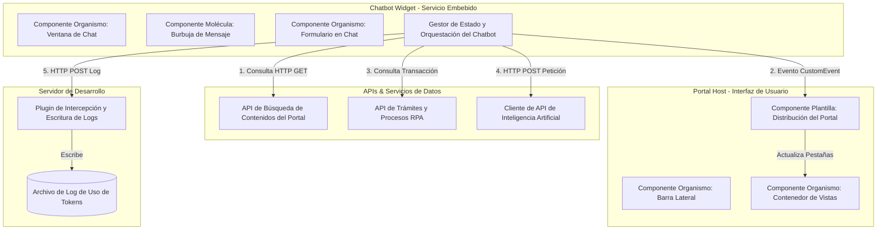

# Propuesta Conceptual y Diseño de Arquitectura: Chatbot El Retiro

Este documento contiene la propuesta conceptual y el diseño arquitectónico para la construcción del chatbot inteligente integrado en el portal de la **Alcaldía de El Retiro**. Detalla la estructura lógica de los componentes, la planeación de los flujos de red, el enrutamiento semántico local y los mecanismos diseñados para el ahorro y registro de tokens de Inteligencia Artificial.

---

## 1. Diseño de Arquitectura y Desacoplamiento (Widget Embebido)

El sistema se concibe bajo el patrón **Widget Embebido / Bridge**, emulando una arquitectura de microservicios. Para garantizar la portabilidad, el portal principal (Host) y el widget del chatbot se desarrollarán de forma totalmente desacoplada a nivel de software. Esto permitirá inyectar el chatbot en cualquier portal municipal en el futuro mediante un único script de integración.



### Mecanismo de Comunicación Diseñado:
1. **Lectura de Recursos (Portal -> Chatbot)**: El chatbot no compartirá variables internas de la interfaz del portal. Consumirá la información disponible realizando peticiones HTTP `fetch` a la *API de Búsqueda de Contenidos del Portal*.
2. **Escritura / Acción (Chatbot -> Portal)**: Cuando el chatbot detecte que debe redirigir al usuario a una sección del portal, emitirá un evento global del navegador (`CustomEvent` del estándar HTML5). El portal escuchará este evento en su *Componente Plantilla de Distribución* y reaccionará cambiando la sección activa y enfocando el contenido en pantalla.

---

## 2. Organización del Sistema (Metodología de Diseño Atómico)

Para garantizar un desarrollo modular y fácil mantenimiento, la interfaz gráfica del sistema se estructurará bajo la metodología conceptual de **Diseño Atómico (Atomic Design)**:

### Componentes Lógicos a Desarrollar:

* **Atoms (Átomos)**: Componentes visuales básicos, indivisibles y sin dependencias.
  * **Componente de tipo Átomo: Indicador de Estado LED**: Muestra un punto luminoso con una animación CSS de pulso para indicar si el asistente virtual está activo.
  * **Componente de tipo Átomo: Etiqueta de Categorización (Badge)**: Contenedor de color para clasificar visualmente el tipo de información o estadísticas.
  * **Componente de tipo Átomo: Botón Interactivo**: Control común que soporta hover y micro-interacciones.
  * **Componente de tipo Átomo: Campo de Entrada de Texto**: Cuadro de entrada estilizado con efecto de transparencia y bordes responsivos.

* **Molecules (Moléculas)**: Agrupaciones de átomos que cumplen una funcionalidad básica.
  * **Componente de tipo Molécula: Burbuja de Conversación (Chat Bubble)**: Globo que formatea el texto de la conversación y renderiza dinámicamente imágenes de productos y enlaces de descarga.
  * **Componente de tipo Molécula: Botonera de Respuestas Rápidas (Quick Replies)**: Menú de botones predictivos que se limpia automáticamente cuando el usuario avanza de flujo.

* **Organisms (Organismos)**: Módulos complejos con lógica de negocio o integraciones de red.
  * **Componente de tipo Organismo: Formulario Temático en Chat (Chat Form)**: Formulario dinámico embebido en el chat para capturar datos (cédulas, correos) de forma estructurada. Se bloquea tras su envío para mantener la coherencia del chat.
  * **Componente de tipo Organismo: Ventana de Chat Flotante**: Contenedor principal del asistente, que aloja el visor de mensajes, las respuestas rápidas y el pie de escritura.
  * **Componente de tipo Organismo: Barra Lateral de Navegación (Sidebar)**: Menú de acceso del portal principal.
  * **Componente de tipo Organismo: Contenedor de Vistas del Portal (Portal View)**: Enrutador que dibuja e intercambia las diferentes vistas de información municipal.

* **Templates (Plantillas)**:
  * **Componente de tipo Plantilla: Distribución del Portal (Portal Layout)**: Orquestador general del portal que une el menú, las vistas de contenido y el chatbot flotante, controlando la recepción de eventos de navegación.

---

## 3. Flujos Técnicos del Asistente

### Flujo de Redirección Semántica Local (Búsqueda del Portal)
Para responder preguntas del portal y guiar al usuario sin consumir llamadas al LLM (ahorro de costos), el chatbot procesará las búsquedas de la siguiente manera:

```
[Usuario escribe: "muéstrame el predial"]
       │
       ▼
[El Gestor de Estado del Chatbot procesa la entrada]
       │
       ▼
[Petición a la API de Búsqueda de Contenidos]
       │
       ├─► Limpia la consulta (remueve tildes y mayúsculas)
       ├─► Tokeniza la búsqueda (separa palabras del usuario)
       └─► Verifica si coincide con las etiquetas (tags) de la base de contenidos
               │
               ▼
   [¿Existe coincidencia de etiqueta o sección?]
       ├── SÍ ──► [Emite evento global de navegación con el ID de la sección]
       │                │
       │                ▼
       │          [El Portal Layout intercepta el evento]
       │                │
       │                ├─► Cambia la pestaña activa del portal (ej: a "Trámites")
       │                ├─► Hace scroll suave hasta la tarjeta del Impuesto Predial
       │                └─► Aplica animación de sombreado brillante ("glow-highlight")
       │
       └── NO ──► [Envía el historial de chat a la API de Inteligencia Artificial]
```

---

### Flujo de Ahorro y Log de Tokens (IA Gemini)
El diseño del chatbot contempla una optimización severa en el uso de Inteligencia Artificial:

1. **System Prompt de Concisión**: Se inyecta una regla de sistema en el LLM que restringe sus respuestas a un máximo de 1-2 líneas directas, penalizando la palabrería para acortar el tamaño de la respuesta.
2. **Límite de Salida Técnico**: Se restringe la respuesta en el servidor de IA mediante el parámetro de configuración de generación de máximo 60 tokens.
3. **Registro Interno (Log de Servidor)**:
   - Dado que los datos de costos no son de interés del ciudadano final, el chatbot no mostrará estadísticas de tokens en pantalla.
   - Tras cada respuesta de la IA, el chatbot envía de forma silenciosa una petición `POST` al servidor.
   - El *Servidor de Desarrollo* intercepta la petición y escribe los datos en caliente en el *Archivo de Log de Uso de Tokens* ubicado en el servidor para posterior revisión del equipo administrador.

---

### Integración de Trámites y Procesos Automatizados (API y RPA)
- **Captura Estructurada**: Cuando el usuario elija un trámite (Sisbén o Impuesto Predial), el bot solicitará los datos requeridos (número de identificación) mediante el *Componente de tipo Organismo: Formulario Temático en Chat* en la conversación.
- **Flujo RPA**: Al iniciar el proceso RPA, el sistema ejecutará de forma asíncrona una secuencia de logs temporizados reportando el estado del robot. Al finalizar, Gemini generará una respuesta muy corta de confirmación y se adjuntará un componente interactivo para descargar el archivo del reporte.
- **Archivos e Imágenes**: La burbuja de mensajes estará capacitada para previsualizar de forma nativa la imagen del predio consultado o el certificado del Sisbén, y mostrará botones estilizados de descarga.

---

## 4. Simulador de IA Local (Pruebas del Prototipo)

Para permitir demostraciones ágiles del prototipo sin depender de conectividad ni de claves de API externas:
- El *Gestor de Estado del Chatbot* verificará si existe una API Key de producción configurada.
- Si no está presente, redirecciona la consulta al *Simulador Local de Inteligencia Artificial*.
- Este componente analiza palabras clave mediante expresiones regulares y genera respuestas simuladas que imitan el comportamiento del modelo de producción, reportando de igual manera las estadísticas de tokens al servidor de logs.

---

## 5. Simulación de Integración en el Entorno Local (Localhost)

Para validar este diseño arquitectónico de microservicio en el entorno de desarrollo local (Localhost), hemos estructurado la simulación de la siguiente manera:

1. **Separación de Código**:
   * El Portal se carga como una aplicación React independiente.
   * El Chatbot se carga como una aplicación React paralela y aislada. No comparten estados de React ni contextos en memoria.
2. **Inyección por Script**:
   * En el archivo de entrada del navegador, se inyectan ambas aplicaciones mediante etiquetas de script independientes:
     ```html
     <!-- Carga el portal municipal host -->
     <script type="module" src="/src/main.jsx"></script>
     
     <!-- Inyección del script del chatbot desde el servidor local (localhost:5173) -->
     <script type="module" src="http://localhost:5173/src/embed.jsx"></script>
     ```
   * **Soporte Multi-servidor (CORS)**: Se ha habilitado `cors: true` en la configuración del servidor de desarrollo. Esto permite copiar la etiqueta `<script type="module" src="http://localhost:5173/src/embed.jsx"></script>` e inyectarla en **cualquier otro proyecto que corra en un puerto o servidor local distinto** (ej. puerto 8000, PHP, Apache, Python server), y el chatbot se renderizará y cargará con total normalidad.
3. **Comportamiento en Ejecución**:
   * El script del chatbot se ejecuta, crea dinámicamente un nodo de anclaje `div` en el cuerpo del documento del portal, e inicializa su propio árbol de React.
   * Cuando el chatbot ejecuta una acción, emite un evento global nativo que es escuchado por el portal para cambiar de vista, demostrando el funcionamiento real del widget en localhost.
